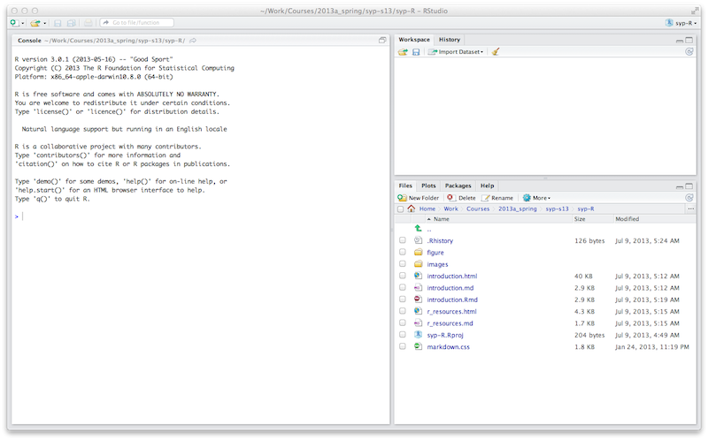
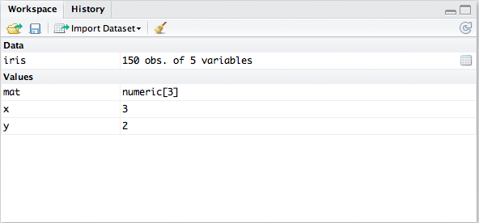
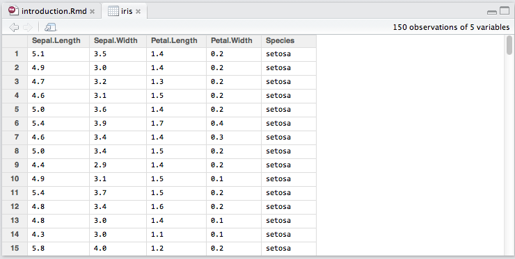
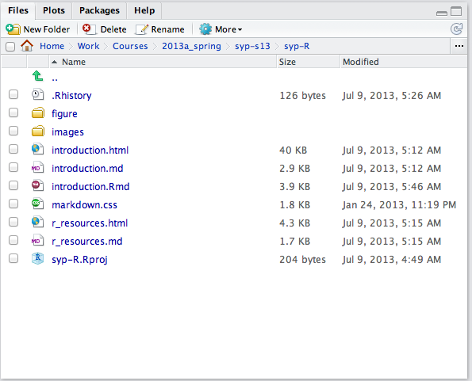
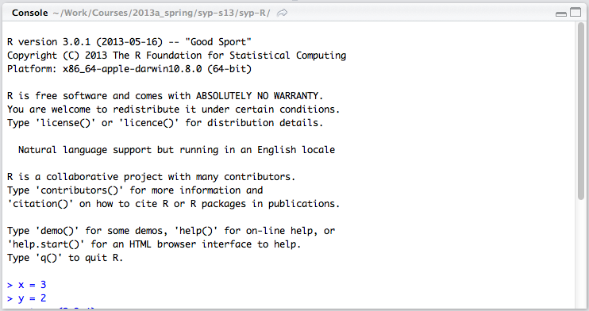
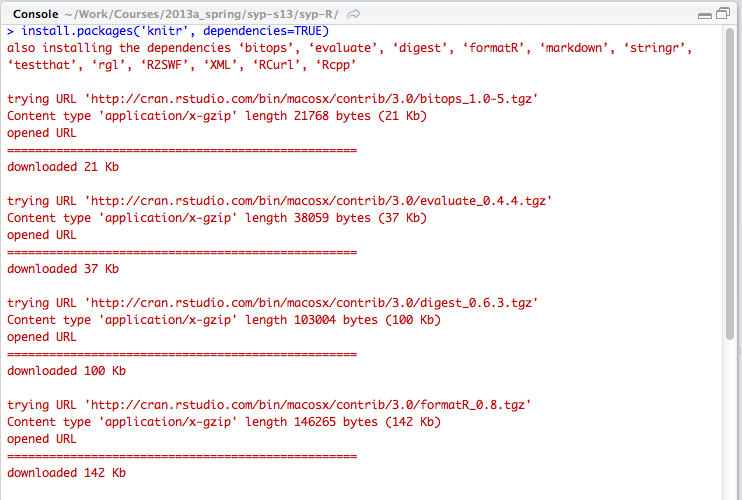

[R](http://www.r-project.org/) is a free, open-source software environment for statistical computing and graphics.  It is able to compile and run across a wide variety of UNIX platforms, Windows, and MacOS.  If after running through the examples today, you would like to learn more about R or complete additional examples, you can download and install `R` on your own computer.

Why use R?

* R is open-source and available across OS platforms, therefore the code used and produced here can be re-run at home.
* R is easily extended by users.
* R is a popular and professional choice for many statisticians, data scientists, and machine learning researchers.

## R Documentation

* "Official" introduction manual [HTML](http://cran.r-project.org/doc/manuals/R-intro.html) | [PDF](http://cran.r-project.org/doc/manuals/R-intro.pdf)
* "Official" FAQ [HTML](http://cran.r-project.org/doc/FAQ/R-FAQ.html)
  * MacOSX FAQ [HTML](http://cran.r-project.org/bin/macosx/RMacOSX-FAQ.html)
  * Windows FAQ [HTML](http://cran.r-project.org/bin/windows/base/rw-FAQ.html)
* Additional documentation and references are available on the main page for this talk [HTML](http://www.cs.mtu.edu/~lebrown/TechHacks-f13/)

## RStudio

[RStudio](http://rstudio.org/) is an integrated development environment (IDE) for R.  The RStudio IDE is free and open-source that works across Windows, Mac, and Linux platforms. 

The examples will be described and made available using [R Markdown](http://www.rstudio.com/ide/docs/r_markdown) (integrates [Markdown](http://daringfireball.net/projects/markdown), a simple formatting syntax for web pages, with R scripts) and [Sweave](http://www.statistik.lmu.de/~leisch/Sweave/) (integrates LaTeX, a document formatting syntax, with R scripts).  R Studio allows easy use and creation of these documents, but requires the [knitr](http://yihui.github.com/knitr/) R package.

## Installing RStudio

RStudio can be downloaded and installed on a Mac, Windows, or Linus machine using the directions provided. 

## Using RStudio

RStudio can be started on the MTU lab machine by selecting Applications -> Programming -> RStudio or from the command line:

```bash
>> rstudio
```

The initial view of RStudio should look similar to the following:


The RStudio environment is made of several panels

*Workspace Panel*

The workspace panel displays the variables, functions, data frames and other objects that are in the current workspace. Data can be imported from several other data formats, or cleared.  



For data loaded into the workspace, it can be selected (click on `iris`) to view the data set.



*Files Panel*

The files panel lists the files located in the current working directory.  Additional tabs for plots, packages, and help display the current figure, list of packages installed/loaded, and documentation information respectively.



*Console Panel*

The console panel is where the underlying R commands are entered.  



*Scripting Panel*

The scripting panel is where R scripts (or RMarkdown documents) can be edited. 

## Installing R packages

Once you have started RStudio, for the projects used in this session you may be asked to install additional R packages.  Those packages can be downloaded and installed from the R Console. 

### Example: Installing Knitr

The knitr package can be installed via:

```r
install.packages("knitr", dependencies = TRUE)
```

On the MTU lab machines, it will first try to install the package to the network drive, then ask to install the package to a local library (accept this choice).

Note, when installing this (and other packages), the process will show comments of what it is downloading in red.



## RMarkdown

Look at the [RStudio Documentation](http://rmarkdown.rstudio.com) on how to create R Markdown files and convert them to HTML.  For instance, this file can be converted to HTML using the Knit HTML button on the file `introduction.Rmd`.

The file can also be converted on the console with 

```r
library('rmarkdown')
render("introduction.Rmd")
```

### HTML Style

CSS can be used to generate "better" formatted documents. The standard format can be replaced by adjusting the yaml header for this document to include a CSS file, specifically the file `min.css`.

```html
---
title: "Introduction to R"
author: "cs4821-s17"
date: "January 10, 2017"
output: 
  html_document:
  theme: null
  css: min.css
  highlight: null
---
```

### Other formatting

Additional formating, templating and themes can be used.  Details and resources can be found at [RMarkdown](http://rmarkdown.rstudio.com).  

For example, use `theme` to specify a Boostrap theme to be used, e.g., `cerulean`, `cosmo`, `spacelab`, `united`, etc..  When using your own css style, the theme should be set to "null", and the CSS style file specified in the `css` parameter.

The option of `highlight` can be used to select the syntax highlighting style, e.g., `pygments`, `kate`, `monochrome`, etc. 

```html
---
title: "test"
output:
  html_document:
    theme: flatly
    highlight: monochrome
---
```

## Render with command line 

This file was rendered from the command line using the following commands:

```bash
Rscript -e "rmarkdown::render('introduction.Rmd')"
```

The files needed to create this page are:

```
_output.yml
introduction.Rmd
min.css
after_body.html
images\*
```

The **\_output.yml** file consists of:

```
html_document:
  self_contained: true
  theme: null
  css: min.css
  highlight: null
  mathjax: null
  toc_depth: 2
  includes:
    after_body: after_body.html 
```


